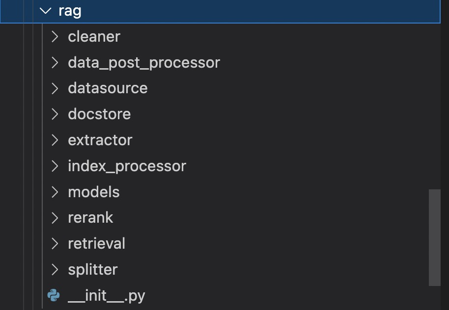
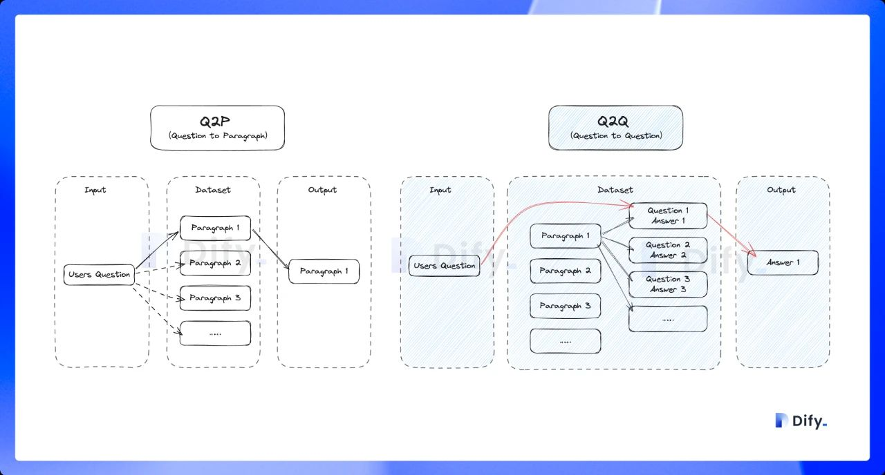

## **RAG 流程概览**

### RAG 的概念解释

向量检索为核心的 RAG 架构已成为解决大模型获取最新外部知识，同时解决其生成幻觉问题时的主流技术框架，并且已在相当多的应用场景中落地实践。

开发者可以利用该技术低成本地构建一个 AI 智能客服、企业智能知识库、AI 搜索引擎等，通过自然语言输入与各类知识组织形式进行对话。以一个有代表性的 RAG 应用为例：

在下图中，当用户提问时 “美国总统是谁？” 时，系统并不是将问题直接交给大模型来回答，而是先将用户问题在知识库中（如下图中的维基百科）进行向量搜索，通过语义相似度匹配的方式查询到相关的内容（拜登是美国现任第46届总统…），然后再将用户问题和搜索到的相关知识提供给大模型，使得大模型获得足够完备的知识来回答问题，以此获得更可靠的问答结果。

.png)

**为什么需要这样做呢？**

我们可以把大模型比做是一个超级专家，他熟悉人类各个领域的知识，但他也有自己的局限性，比如他不知道你个人的一些状况，因为这些信息是你私人的，不会在互联网上公开，所以他没有提前学习的机会。

当你想雇佣这个超级专家来充当你的家庭财务顾问时，需要允许他在接受你的提问时先翻看一下你的投资理财记录、家庭消费支出等数据。这样他才能根据你个人的实际情况提供专业的建议。

**这就是 RAG 系统所做的事情：帮助大模型临时性地获得他所不具备的外部知识，允许它在回答问题之前先找答案。**

根据上面这个例子，我们很容易发现 RAG 系统中最核心是外部知识的检索环节。专家能不能向你提供专业的家庭财务建议，取决于能不能精确找到他需要的信息，如果他找到的不是投资理财记录，而是家庭减肥计划，那再厉害的专家都会无能为力。


目前大模型知识库的构建一般是使用检索增强生成 (RAG) 的技术方案，RAG 首先会检索与问题相关的文档，之后会将检索到的信息提供给大模型（LLM），LLM 使用它们来生成更准确、更相关的响应。RAG 有两个核心组件：

- 检索组件：负责从外部知识库中检索与用户查询相关的信息。
- 生成组件：负责生成最终响应。生成组件通常是 LLM，例如 GPT-3 或 ChatGLM 等；

RAG 的常规流程如下所示：


上面的流程图中，第 1~14 步对应于信息的检索，而第 15 步对应于响应的生成。可以看到 RAG 最核心的是信息检索。下面主要关注 RAG 的检索流程。

RAG 的信息检索主要包含两个步骤：

- 向量数据库的构建，对应于上面的 1~7 步，通过对原始的文件信息进行预处理，方便后续快速检索；
- 用户查询流程，对应于上面的 8~15 步，通过用户查询获取匹配的信息，通过构造生成合适的 prompt，提供给大模型得到最终的结果；

### 向量数据库的构建

向量数据库的构建主要包含下面的步骤：

1. 本地文件的加载，实际中文件的类型可能比较多样化，需要根据文件类型选择对应的加载器。文件加载需要去除无关的信息，从而保证后续的高效处理；
2. 文件切分，单个文件的内容可能会过大，考虑到大模型实际可用的输入有限，一般会对加载的原始文件执行切分，得到对应的文件块；
3. 文件块向量化，为了方便后续根据用户查询匹配对应的文件块，因此会进行文件块的向量化，这样就根据查询数据的向量与文件块的向量之间的差异确定匹配的文件块；
4. 向量库的构建，基于向量化后的文件块构建向量数据库，后续就可以在向量数据库中进行查询；

### 用户检索流程

用户检索的流程主要包含下面的核心步骤：

1. 向量化查询语句，从向量数据库中获取匹配的文件块；
2. 将匹配的文件块与用户的查询语句合并构造为完整的 prompt；
3. 基于 prompt 发起 LLM 查询，获得 LLM 响应；

上面的流程包含 RAG 的核心流程，如果希望提升 RAG 的效果，需要对流程中的特定环境进行优化。

一般情况下，RAG 服务会包含如下所示的功能模块：

文件加载的支持；
文件的预处理策略；
文件检索的支持；
检索结果的重排；
大模型的处理；
因为 RAG 服务只是一个基础模块，没有过多强调 RAG 服务的独特设计，但是依旧可以看到一个独特点：

支持 Q&A 模式，与上述普通的「Q to P」（问题匹配文本段落）匹配模式不同，它是采用「Q to Q」（问题匹配问题）匹配工作；
丰富的召回模式，支持 N 选 1 召回 和 多路召回；
下面的部分会对独特之处进行详细展开。

### 核心模块解读

从目前的实现来看，RAG 设计采用模块化设计，RAG 的代码实现都在 `api/core/rag` 中，从代码结构上也很容易理解各个模块的作用：



##### 1. cleaner

**作用**：数据清理模块，用于处理和清理原始数据，以便后续处理和分析。

- **clean_processor.py**: 清理处理器的主文件。
  - **默认清理**：去除文本中的一些无效符号和控制字符。
  - **自定义规则处理**：根据提供的处理规则，对文本进行进一步的预处理，例如去除多余的空格、去除URL和电子邮件地址等。
- **cleaner_base.py**: 清理处理器的基类，定义了基本的清理接口和方法。

##### 2. data_post_processor

**作用**：数据后处理模块，用于对初步处理后的数据进行进一步处理和优化。

- **data_post_processor.py**: 数据后处理的主文件。用于在文档检索之后对文档进行进一步的处理，包括重排序和重新组织。
  - 重排序用模型
  - 重新组织：将文档列表中的奇数索引元素和偶数索引元素分开处理，并将偶数索引元素倒序排列后，与奇数索引元素合并，形成一个新的文档列表。通过重新排序文档，可以避免某些模式的重复出现，增加结果的多样性。
- **reorder.py**: 数据重排序文件。

##### 3. datasource

**作用**：数据源模块，处理和管理各种数据源的相关操作。

- **keyword**/: 关键词处理。

  - **jieba**/: 基于jieba的关键词处理。实现了基于 `Jieba` 分词库的关键词提取和管理功能，包括向关键词表添加文档、根据查询检索文档等核心功能
    - **jieba.py**: jieba关键词处理主文件。
      - 并发访问和数据持久化的问题主要通过以下几种方式处理：
        - **并发访问的处理**使用 Redis 锁（Redis Lock）来避免并发访问问题，确保同一时间只有一个线程可以修改关键词表。`redis_client.lock(lock_name, timeout=600)` 调用 Redis 客户端的 `lock` 方法创建一个分布式锁。使用 `with` 语句上下文管理器确保锁的自动释放，即使在发生异常的情况下，锁也会被正确释放，从而避免死锁。使用 `with redis_client.lock(lock_name, timeout=600)` 语句来获取锁，其中 `lock_name` 是一个基于数据集 ID 生成的唯一锁名称，`timeout` 是锁的超时时间（默认600），单位为秒。
        - **数据库持久化**：如果关键词表的数据源类型是数据库（`data_source_type` 为 `database`），则将关键词表数据序列化为 JSON 格式，并存储在数据库中。使用 SQLAlchemy 的 `db.session.add()` 和 `db.session.commit()` 方法来添加和提交数据库事务。
          - **文件存储持久化**：如果关键词表的数据源类型不是数据库，则将关键词表数据序列化为 JSON 格式，并存储在文件系统中。（详见/extensions/storage里的文件系统类）
    - **jieba_keyword_table_handler.py**: jieba关键词表处理器。
    - **stopwords.py**: 停用词处理。
  - **keyword_base.py**: 关键词处理基类。
  - **keyword_factory.py**: 关键词处理工厂。

- **retrieval_service.py**: 数据检索服务。用于在给定的数据集和查询条件下，执行不同的检索方法（关键词搜索、语义搜索、全文搜索）。

  **关键词搜索** 主要基于关键词的出现频率和位置。

  **语义搜索** 主要基于嵌入向量之间的相似度，能够理解查询的语义。

  **全文搜索** 使用全文索引技术，根据文本内容的匹配度进行检索。

  - 关键词搜索（`keyword_search` 方法）：该方法在关键词搜索线程中执行，通过关键词匹配查找文档。
  - 语义搜索（`embedding_search` 方法）：该方法在语义搜索线程中执行，通过向量匹配查找文档，并根据需要进行重排序。
  - 全文搜索（`full_text_index_search` 方法）：该方法在全文搜索线程中执行，通过全文索引查找文档，并根据需要进行重排序。

- **vdb**/: 向量数据库处理。

  - 这里没啥好说的，照着对应的向量数据库官方文档操作就行了

##### 4. docstore

**作用**：文档存储模块，用于管理和存储文档数据。

- **dataset_docstore.py**: 数据集文档存储。

##### 5. extractor

**作用**：数据提取模块，用于从各种文件格式中提取数据。

##### 6. index_processor

**作用**：索引处理模块，用于对数据进行索引处理，以便快速检索。

- **constant/index_type.py**: 索引类型定义。
- **index_processor_base.py**: 索引处理基类。提供了抽象方法和部分实现，用于处理文档的抽取、转换、加载、清理和检索操作。
- **index_processor_factory.py**: 索引处理工厂。用于根据指定的索引类型初始化并返回相应的索引处理器。主要有ParagraphIndexProcessor和QAIndexProcessor。
- **processor**/: 具体的索引处理器实现。
  - **paragraph_index_processor.py**: 段落索引处理器。
  - **qa_index_processor.py**: 问答索引处理器。
    - 关于问答格式的一些特殊方法：
      - **`_format_qa_document(self, flask_app: Flask, tenant_id: str, document_node, all_qa_documents, document_language)`**:
        - 使用指定的问答生成模型 `LLMGenerator` 生成问答格式的文档。
        - 解析生成的问答文本并将其转换为 `Document` 对象。
        - 使用多线程方式处理每个文档节点。
      - **`_format_split_text(self, text)`**:
        - 使用正则表达式解析问答文本，将其分割成问答对列表（Q&A）。
        - 返回格式化后的问答对列表。

##### 7. models

**作用**：模型定义模块，用于定义数据模型和结构。

- **document.py**: 文档数据模型。

##### 8. rerank

**作用**：重排序模块，用于对检索结果进行重新排序。

- **rerank.py**: 重排序功能实现。

##### 9. retrieval

**作用**：数据检索模块，用于从数据源中检索相关数据。

- **dataset_retrieval.py**: 数据集检索。

- **output_parser**/: 检索结果解析器。

  - **react_output.py**: 处理react格式的检索输出。
  - **structured_chat.py**: 处理结构化聊天的检索输出。

- **retrival_methods.py**: 各种检索方法的实现。

- **router**/

  : 检索路由器。

  - **multi_dataset_function_call_router.py**: 多数据集函数调用路由器。
  - **multi_dataset_react_route.py**: 多数据集react路由。

##### 10. splitter

**作用**：文本拆分模块，用于将文本数据拆分成更小的部分。

`fixed_text_splitter.py` 提供了一个固定分隔符的实现，而 `text_splitter.py` 提供了更多通用的抽象和具体实现。

- **fixed_text_splitter.py**: 固定长度文本拆分器。

  - **主要类和方法：**
    1. **EnhanceRecursiveCharacterTextSplitter**
       - 继承自 `RecursiveCharacterTextSplitter`，主要用于实现 `from_encoder` 方法，以避免使用 `tiktoken`。
       - from_encoder方法：
         - 通过 `embedding_model_instance` 或 `GPT2Tokenizer` 计算文本的 token 数量。
         - 如果是 `TokenTextSplitter` 的子类，会添加额外的参数用于初始化。
    2. **FixedRecursiveCharacterTextSplitter**
       - 继承自 `EnhanceRecursiveCharacterTextSplitter`，实现基于固定分隔符的文本拆分。
       - 构造函数接受一个固定分隔符 `fixed_separator` 和一个分隔符列表 `separators`。
       - split_text方法：
         - 根据 `fixed_separator` 拆分文本。
         - 如果拆分后的小块文本长度超过预设的 chunk 大小，会进一步递归拆分。
       - recursive_split_text方法：
         - 递归地使用不同的分隔符拆分文本，直至每个文本块长度不超过预设的 chunk 大小。

- **text_splitter.py**: 文本拆分器。

  - **主要类和方法：**

    1. **TextSplitter**
       - 抽象基类，定义了文本拆分的基本接口和方法。
       - __init__方法：
         - 接受 chunk 大小、重叠大小、长度计算函数等参数。
       - 抽象方法split_text：
         - 需要具体子类实现，定义具体的文本拆分逻辑。
       - create_documents 和split_documents方法：
         - 将拆分后的文本块创建为 `Document` 对象。
       - 提供一些工厂方法（如 `from_huggingface_tokenizer` 和 `from_tiktoken_encoder`）用于创建具体的文本拆分器。
    2. **CharacterTextSplitter**
       - 具体实现类，基于字符进行文本拆分。
       - split_text方法：
         - 使用正则表达式根据分隔符拆分文本，并合并较小的文本块。
    3. **TokenTextSplitter**
       - 具体实现类，基于 token 进行文本拆分。
       - 使用 `tiktoken` 库进行 token 的编码和解码。
       - split_text方法：
         - 使用 tokenizer 将文本编码为 token 列表，并根据 token 数量进行拆分。
    4. **RecursiveCharacterTextSplitter**
       - 具体实现类，递归地基于字符进行文本拆分。
       - split_text方法：
         - 递归地尝试不同的分隔符拆分文本，直至每个文本块长度不超过预设的 chunk 大小（4000，意味着每个文本块的最大 token 数量是 4000）。

    ### 功能和实现方式

    1. **基于固定分隔符的文本拆分**
       - `FixedRecursiveCharacterTextSplitter` 类实现了这一功能。
       - 通过 `split_text` 方法，根据固定分隔符或递归地使用不同分隔符拆分文本。
    2. **基于字符的文本拆分**
       - `CharacterTextSplitter` 类实现了这一功能。
       - 通过正则表达式和分隔符，将文本拆分为小块，并合并较小的文本块。
    3. **基于 token 的文本拆分**
       - `TokenTextSplitter` 类实现了这一功能。
       - 使用 `tiktoken` 库进行 token 编码和解码，根据 token 数量拆分文本。
    4. **递归地基于字符的文本拆分**
       - `RecursiveCharacterTextSplitter` 类实现了这一功能。
       - 递归地尝试不同的分隔符拆分文本，直至每个文本块长度不超过预设的 chunk 大小。

### 主要功能

#### 文件加载

文件加载都是在 api/core/rag/extractor/extract_processor.py 中实现的，主要的文件解析是基于 unstructured 实现，另外基于其他第三方库实现了特定格式文件的处理

比如对于 pdf 文件，会基于 pypdfium2 进行解析，html 是基于 BeautifulSoup 进行解析，这部分代码实现都比较简单，就不展开介绍了。

#### 文件预处理

加载的模型中的内容可能会存在一些问题，比如多余的无用字符，编码错误或其他的一些问题，因此需要对文件解析的内容进行必要的清理，这部分代码实现在 api/core/rag/cleaner 中。实际的清理都是基于 unstructured cleaning 实现的，主要就是将不同的清理策略封装为同样的接口，方便应用层自由选择。这部分实现也比较简单，感兴趣可以自行了解下。

#### Q&A 模式

Q&A 分段模式功能，与普通的「Q to P」（问题匹配文本段落）匹配模式不同，它是采用「Q to Q」（问题匹配问题）匹配工作，在文档经过分段后，经过总结为每一个分段生成 Q&A 匹配对，当用户提问时，系统会找出与之最相似的问题，然后返回对应的分段作为答案。这种方式更加精确，因为它直接针对用户问题进行匹配，可以更准确地获取用户真正需要的信息。

在知识库上传文档时，系统将对文本进行分段，使得用户的提问（输入）能匹配到相关的文本段落（Q to P），最后输出结果。



从上面的流程可以看到，Q&A 模式下会根据原始文档生成问答对，实现实现是在 `api/core/llm_generator/llm_generator.py` 中：

```python
# 构造 prompt

GENERATOR_QA_PROMPT = (
    '<Task> The user will send a long text. Generate a Question and Answer pairs only using the knowledge in the long text. Please think step by step.'
    'Step 1: Understand and summarize the main content of this text.\n'
    'Step 2: What key information or concepts are mentioned in this text?\n'
    'Step 3: Decompose or combine multiple pieces of information and concepts.\n'
    'Step 4: Generate questions and answers based on these key information and concepts.\n'
    '<Constraints> The questions should be clear and detailed, and the answers should be detailed and complete. '
    'You must answer in {language}, in a style that is clear and detailed in {language}. No language other than {language} should be used. \n'
    '<Format> Use the following format: Q1:\nA1:\nQ2:\nA2:...\n'
    '<QA Pairs>'
)

def generate_qa_document(cls, tenant_id: str, query, document_language: str):
    prompt = GENERATOR_QA_PROMPT.format(language=document_language)

    model_manager = ModelManager()
    model_instance = model_manager.get_default_model_instance(
        tenant_id=tenant_id,
        model_type=ModelType.LLM,
    )

    # 拼接出完整的调用 prompt

    prompt_messages = [
        SystemPromptMessage(content=prompt),
        UserPromptMessage(content=query)
    ]

    # 调用大模型直接生成问答对

    response = model_instance.invoke_llm(
        prompt_messages=prompt_messages,
        model_parameters={
            'temperature': 0.01,
            "max_tokens": 2000
        },
        stream=False
    )

    answer = response.message.content
    return answer.strip()

```

可以看到就是通过一个 prompt 就完成了原始文档到问答对的转换，可以看到大模型确实可以帮助实现业务所需的基础能力。

#### 文件检索

知识库的检索是在 api/core/workflow/nodes/knowledge_retrieval/knowledge_retrieval_node.py 中实现的，与常规的 RAG 存在明显不同之处在于支持了丰富的召回模式。

#### 丰富的召回模式

用户可以自由选择所需的召回模式：

**N 选 1 召回**，根据用户意图和知识库描述，由 LLM 自主判断选择最匹配的单个知识库来查询相关文本。

**多路召回**，根据用户意图同时匹配所有知识库，从多路知识库查询相关文本片段，经过重排序步骤，从多路查询结果中选择匹配用户问题的最佳结果，需配置 Rerank 模型 API。

下面以 `N 选 1 召回` 为例介绍下文件的检索，对应的流程如下所示：


`N 选 1 召回` 的知识库选择是基于用户问题与知识库描述的语义匹配性来进行选择，存在 `Function Call`/`ReAct` 两种模式，实现代码在 `api/core/rag/retrieval/dataset_retrieval.py` 中，具体如下所示：

```python
tools = []
# 根据用户输入的意图，使用知识库的描述构造 prompt

for dataset in available_datasets:
    description = dataset.description
    if not description:
        description = 'useful for when you want to answer queries about the ' + dataset.name

    description = description.replace('\n', '').replace('\r', '')
    message_tool = PromptMessageTool(
        name=dataset.id,
        description=description,
        parameters={
            "type": "object",
            "properties": {},
            "required": [],
        }
    )
    tools.append(message_tool)

# 支持 ReAct 模式

if planning_strategy == PlanningStrategy.REACT_ROUTER:
    react_multi_dataset_router = ReactMultiDatasetRouter()
    dataset_id = react_multi_dataset_router.invoke(query, tools, model_config, model_instance,
                                                    user_id, tenant_id)
# 支持 Function Call 模式

elif planning_strategy == PlanningStrategy.ROUTER:
    function_call_router = FunctionCallMultiDatasetRouter()
    dataset_id = function_call_router.invoke(query, tools, model_config, model_instance)


```

- `Function Call` 模式就是构造了一个 prompt，让大模型根据描述选择合适的知识库，实现比较简单
- `ReAct` 模式则是基于 [ReAct](https://arxiv.org/pdf/2210.03629) , 通过推理 + 任务的结合选择正确的知识库

#### 知识库检索

在前面根据模式选择了对应的知识库之后，就可以在单个知识库内进行检索，目前支持的检索方式包含下面三种：

向量检索，通过生成查询嵌入并查询与其向量表示最相似的文本分段。
全文检索，索引文档中的所有词汇，从而允许用户查询任意词汇，并返回包含这些词汇的文本片段。
混合检索，同时执行全文检索和向量检索，并附加重排序步骤，从两类查询结果中选择匹配用户问题的最佳结果。
从实际的代码来看，还有一个 关键词检索 的能力，但是没有特别介绍，不确定是否是效果上还不够稳定，可以关注下后续的进展。混合检索的流程如下所示：


实际的实现在 `api/core/rag/datasource/retrieval_service.py` ：

```python
# 关键词检索

if retrival_method == 'keyword_search':
    keyword_thread = threading.Thread(target=RetrievalService.keyword_search, kwargs={
        'flask_app': current_app._get_current_object(),
        'dataset_id': dataset_id,
        'query': query,
        'top_k': top_k,
        'all_documents': all_documents,
        'exceptions': exceptions,
    })
    threads.append(keyword_thread)
    keyword_thread.start()

# 向量检索（混合检索中也会调用）

if RetrievalMethod.is_support_semantic_search(retrival_method):
    embedding_thread = threading.Thread(target=RetrievalService.embedding_search, kwargs={
        'flask_app': current_app._get_current_object(),
        'dataset_id': dataset_id,
        'query': query,
        'top_k': top_k,
        'score_threshold': score_threshold,
        'reranking_model': reranking_model,
        'all_documents': all_documents,
        'retrival_method': retrival_method,
        'exceptions': exceptions,
    })
    threads.append(embedding_thread)
    embedding_thread.start()

# 文本检索（混合检索中也会调用）

if RetrievalMethod.is_support_fulltext_search(retrival_method):
    full_text_index_thread = threading.Thread(target=RetrievalService.full_text_index_search, kwargs={
        'flask_app': current_app._get_current_object(),
        'dataset_id': dataset_id,
        'query': query,
        'retrival_method': retrival_method,
        'score_threshold': score_threshold,
        'top_k': top_k,
        'reranking_model': reranking_model,
        'all_documents': all_documents,
        'exceptions': exceptions,
    })
    threads.append(full_text_index_thread)
    full_text_index_thread.start()

for thread in threads:
    thread.join()

# 混合检索之后会执行向量和文本检索结果合并后的重排序

if retrival_method == RetrievalMethod.HYBRID_SEARCH:
    data_post_processor = DataPostProcessor(str(dataset.tenant_id), reranking_model, False)
    all_documents = data_post_processor.invoke(
        query=query,
        documents=all_documents,
        score_threshold=score_threshold,
        top_n=top_k
    )

```

#### 检索结果重排

检索结果的重排也比较简单，就是通过外部模型进行打分，之后基于打分的结果进行排序，实际的实现在 `api/core/model_manager.py` 中：

```python
def invoke_rerank(self, query: str, docs: list[str], score_threshold: Optional[float] = None,
                    top_n: Optional[int] = None,
                    user: Optional[str] = None) \
        -> RerankResult:
    self.model_type_instance = cast(RerankModel, self.model_type_instance)

    # 轮询调用重排序模型，获得重排序得分，并基于得分进行排序

    return self._round_robin_invoke(
        function=self.model_type_instance.invoke,
        model=self.model,
        credentials=self.credentials,
        query=query,
        docs=docs,
        score_threshold=score_threshold,
        top_n=top_n,
        user=user
    )

```

